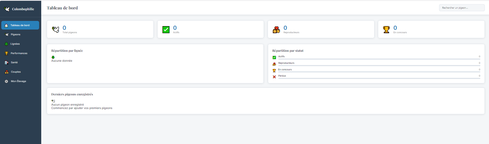
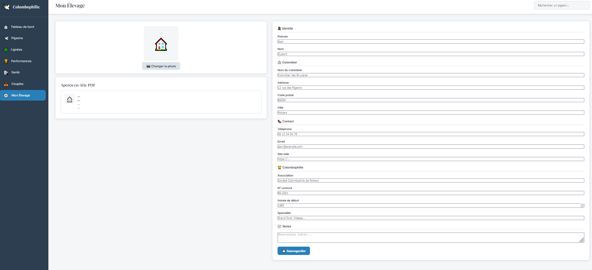
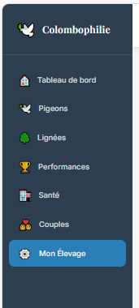

<div align="center">
  

# Colomb — Application Colombophile

</div>

> Application web complète pour éleveurs de **pigeons voyageurs** — suivi des oiseaux, pedigrees, concours, santé, sport et intelligence artificielle. Déploiement via **Docker Desktop**.


[](LICENSE)


## Versions

| Version | Branche | Tag | Statut |
|---------|---------|-----|--------|
| V3.3 (actuelle) | `main` | [v3.3](../../releases/tag/v3.3) | ✅ Production |
| V3 | `main` | [v3.0.0](../../releases/tag/v3.0.0) | ✅ Production |
| V2 | `v2` | [v2.0.0](../../releases/tag/v2.0.0) | 🔒 Archivée |
| V1 | `v1` | [v1.0.0](../../releases/tag/v1.0.0) | 🔒 Archivée |

---

## 🔧 Fonctionnalités

### ✅ V1 — Élevage (stable)

| Module | Description |
|---|---|
| 🐦 **Pigeons** | Fiche individuelle avec photo, bague, lignée, couleur, sexe, statut |
| 🌳 **Pedigree** | Arbre généalogique sur 3 générations, export PDF |
| 📄 **Fiche pigeon** | Document PDF format A5 avec performances, santé et vaccins |
| 💑 **Couples & nichées** | Suivi des accouplements et création des jeunes depuis la nichée |
| 🎨 **Lignées** | Gestion avec code couleur propagé dans toute l'interface |
| 🏆 **Performances** | Enregistrement des concours (vitesse, classement, distance) |
| 💊 **Santé** | Suivi des vaccins, traitements et visites vétérinaires |
| 🤝 **Éleveur** | Profil et coordonnées intégrés dans les exports PDF |
| 📊 **Dashboard** | Vue synthétique des statistiques de l'élevage |

### ✅ V2 — Sport (stable)

| Module | Description |
|---|---|
| 🏃 **Séances d'entraînement** | Saisie des entraînements loft / lancer / concours avec scores |
| 📅 **Historique pigeon** | Timeline des séances avec récupération, condition, motivation |
| 🌍 **Monitoring colonie** | Vue d'ensemble de tous les pigeons actifs avec état de forme |
| 📈 **Analytics** | 4 graphiques : évolution récupération, charge hebdo, température vs récup, régularité |
| 💪 **Condition sportive** | Indices de condition, tendances 90j, impact santé, performances récentes |
| 🥗 **Plans alimentaires** | Calendrier des plans de nutrition selon la période sportive |
| 🤖 **XAI expérimental** | Recommandations explicables, snapshots sportifs, event store |

### ✅ V3 — XAI Engine finalisé (stable sur `main`)

| Module | Description |
|---|---|
| 📊 **Snapshots versionnés** | Fenêtre de calcul étendue 30j, `recovery_trend` calculé, seuils ajustés 70/50/30 |
| 🧠 **XAI Engine** | `compute_age_category()` automatique · yearling/adulte · ELEVEUR_RULES source de vérité |
| ⏱️ **Repos différencié** | 12j yearling / 10j adulte post-concours · messages adaptés par profil |
| 📝 **Boucle feedback** | Outcome modal · résultat concours · share anonymisé · pending feedback dashboard |
| 🛡️ **Robustesse UI** | `renderEmptyState()` · zones blanches éliminées · erreurs API gérées partout |

### ✅ V3.3 — Internationalisation FR / NL / EN (stable sur `main`)

| Module | Description |
|---|---|
| 🌍 **Interface multilingue** | Traduction complète FR / NL / EN via `frontend/js/i18n.js` et `frontend/locales/*.json` |
| 🥗 **Catalogue nutrition traduit** | Ingrédients (avec valeurs nutritionnelles), suppléments, mélanges et plans alimentaires localisés par langue |
| 🌱 **Seeds par langue** | `seed_fr.py` / `seed_nl.py` / `seed_en.py` — catalogue nutrition de base chargé automatiquement au premier lancement selon la langue choisie |
| 🐦 **Élevages de démo optionnels** | `seed_demo_fr.py` / `seed_demo_nl.py` / `seed_demo_en.py` — élevage complet de démonstration (pigeons, concours, entraînements) à charger manuellement |

---

## 🛠️ Stack technique

| Couche | Technologie |
|---|---|
| Backend | Python · FastAPI · SQLAlchemy async (asyncpg) |
| Base de données | PostgreSQL 16 |
| Frontend | HTML / CSS / JavaScript vanilla |
| Conteneurisation | Docker Compose |

---

## 🚀 Lancement rapide

### Prérequis
- [Docker Desktop](https://www.docker.com/products/docker-desktop/) installé et démarré

### Installation

```bash
# Cloner la version stable V3 (recommandé)
git clone https://github.com/FredeHyeres/Colomb.git
cd Colomb

# Ou une version archivée spécifique
git clone -b v2 https://github.com/FredeHyeres/Colomb.git

# Lancer l'application
docker compose up --build
```

| Service | URL |
|---|---|
| 🖥️ Frontend | http://localhost:8080 |
| ⚙️ API | http://localhost:8001 |
| 📚 Documentation API | http://localhost:8001/docs |

---

## 🧰 Utilitaires

```bash
# Vider la base de données (conserve la structure)
docker exec colombo_backend python reset_db.py

# Charger un élevage de démonstration complet (optionnel, selon la langue)
docker exec colombo_backend python seed_demo_fr.py
docker exec colombo_backend python seed_demo_nl.py
docker exec colombo_backend python seed_demo_en.py
```

> ℹ️ Le catalogue nutrition de base (`seed_fr.py` / `seed_nl.py` / `seed_en.py`) est chargé automatiquement au premier lancement selon la langue de l'élevage.

---

## 📸 Captures d'écran





---

## 🤝 Contribution

Les contributions sont les bienvenues ! N'hésite pas à ouvrir une [issue](../../issues) ou une [pull request](../../pulls).

---

## 📜 Licence

© 2025 Tourneur Fred — [Creative Commons BY-NC-ND 4.0](LICENSE)

Ce projet est sous licence **CC BY-NC-ND 4.0** ([texte complet](https://creativecommons.org/licenses/by-nc-nd/4.0/deed.fr)) :

- ✅ Partage et redistribution autorisés (avec attribution)
- ✅ Utilisation et distribution gratuites
- ❌ Modification / création d'œuvres dérivées interdite
- ❌ Usage commercial interdit

---

## 🔍 Mots-clés / Keywords

**Français** : colombophilie · gestion élevage pigeons voyageurs · suivi concours ·
pedigree pigeon · santé colombophile · logiciel colombophile gratuit ·
application pigeon voyageur · suivi loft · baguage pigeon

**Nederlands** : reisduiven beheer · duivensport software · gratis duivenprogramma

**English** : racing pigeon management · homing pigeon loft software ·
free pigeon racing app · pigeon pedigree tracker

---

## 💬 Contact

**Tourneur Fred**
- GitHub : [@FredeHyeres](https://github.com/FredeHyeres)
- Email : [fredtour86@gmail.com](mailto:fredtour86@gmail.com)

---

*Colomb — pigeon loft management app · colombophilie · racing pigeons · homing pigeons · gestion élevage*
